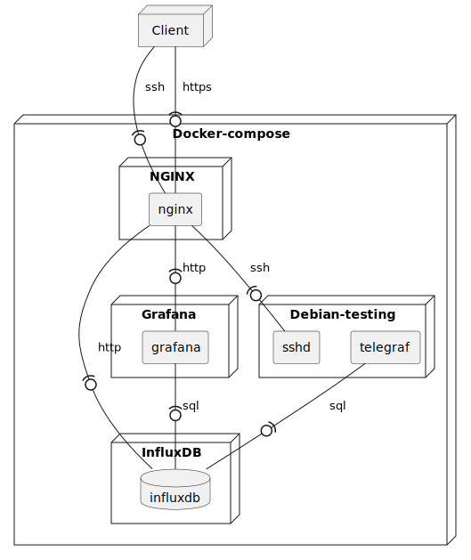

# IoT Platform

An example of a Docker-based IoT platform for collecting hardware data from clinent.

# Deploy Diagram

## Links
- `https://grafana.localhost:9443/`
- `https://influxdb.localhost:9443/`
- `ssh://debian.localhost:922`